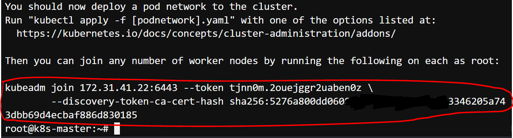
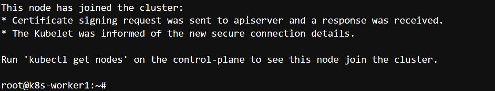
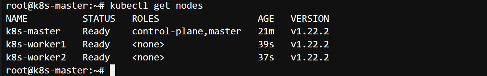

# Task 2 - init, join

### 3개의 노드에 필요한 설정과 k8s 설치 전에 해야할 설정을 진행
#
1. 각 노드에서 hostname을 변경합니다.

Master Node
```
sudo -i
sudo hostnamectl set-hostname k8s-master
sudo -i
```
Worker1 Node
```
sudo -i
sudo hostnamectl set-hostname k8s-worker1
sudo -i
```
Worker2 Node
```
sudo -i
sudo hostnamectl set-hostname k8s-worker2
sudo -i
```
변경 확인 명령어
```
hostnamectl
```

2. kubeadm 초기화 (Master Node 만 진행)
```
kubeadm init --pod-network-cidr=172.16.0.0/16 --apiserver-advertise-address=<Master IP>
```
```
**참고**
kubeadm init 명령어는 Kubernetes 클러스터를 초기화하고 마스터 노드를 설정하기 위해 사용되는 명령어입니다.
이 명령어를 사용하면 새로운 Kubernetes 클러스터를 설정하고 실행할 수 있습니다.
```

출력결과(kubeadm join 이하 명령어)를 잘 저장해둡니다.
3~5분 소요됩니다.


3. Master 노드 설정 (Master Node 만 진행)
```
mkdir -p $HOME/.kube
sudo cp -i /etc/kubernetes/admin.conf $HOME/.kube/config
sudo chown $(id -u):$(id -g) $HOME/.kube/config
export KUBECONFIG=/etc/kubernetes/admin.conf
```
```
**참고** 
kubeadm은 클러스터 구성을 정의하는 구성 파일을 생성합니다. 이 파일에는 클러스터 설정, 네트워크 설정, 인증 설정 등이 포함됩니다.
기본적으로 /etc/kubernetes/admin.conf에 생성됩니다.
```

4. flannel 네트워크 플러그인 설치 (Master Node 만 진행)
```
kubectl create -f https://raw.githubusercontent.com/wsjang619/k8s_course/master/lab1/yaml/flannel.yaml
```


참고링크 : https://github.com/flannel-io/flannel
```
**참고**
kubectl create -f : Kubernetes 클러스터에 리소스를 생성하거나 업데이트하기 위해 사용되는 명령어
```
```
flannel : Kubernetes 클러스터 내에서 Pod 간 통신을 관리하기 위한 네트워크 솔루션 
```

5. kubectl 자동완성 적용 (Master Node 만 진행)
```
source <(kubectl completion bash)
echo "source <(kubectl completion bash)" >> ~/.bashrc
source /etc/bash_completion
echo alias k=kubectl >> ~/.bashrc
source ~/.bashrc
complete -F __start_kubectl k
```


6. Worker 노드와 Master 노드 연동 (Worker Node 만 진행)

```
<kubeadm join 으로 시작하는 2번과정에서 저장해 두었던 명령어>
```



7. 연동 확인 (Master 노드에서 확인)
```
kubectl get nodes
```


